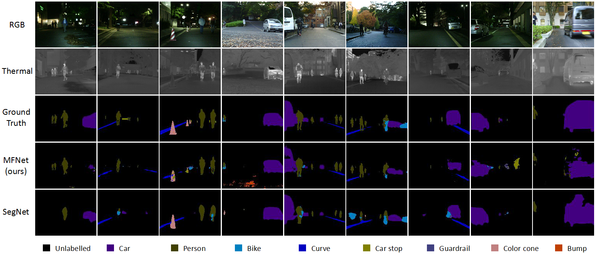

# MFNet-pytorch

Image semantic segmentation using RGB-Thermal images, for example:



Project home page: https://www.mi.t.u-tokyo.ac.jp/static/projects/mil_multispectral/

This is official pytorch implementation of [MFNet: Towards real-time semantic segmentation for autonomous vehicles with multi-spectral scenes](https://ieeexplore.ieee.org/document/8206396/) (IROS 2017). The pdf can be downloaded from [HERE](https://drive.google.com/file/d/1vxMh63QpdxPnG3jhzpQU0fb-2XOzHR-Z/view?usp=sharing) (Google Drive shared file). 

## Introduction

MFNet is a light CNN architecture for multispectral images semantic segmentation, with ~ 1/40x parameters and 6x ~ inference speed, while providing similar or higher accuracy compared to SegNet.

## Requirements

```
* pytorch 0.4.0
* PIL 4.3.0
* numpy 1.14.0
* tqdm 4.19.4
```
## Dataset

We published a new RGB-Thermal semantic segmentation dataset in support of further development of autonomous vehicles in the future. This dataset contains 1569 images (820 taken at daytime and 749 taken at nighttime) which is available in our [project home page](https://www.mi.t.u-tokyo.ac.jp/static/projects/mil_multispectral/)

## Usage

* run demo code use trained model
```
$ cd /path/to/this/repository
$ python run_demo.py
```

* training
```
1. download our dataset
2. set directory of dataset in train.py
3. run train.py
```
